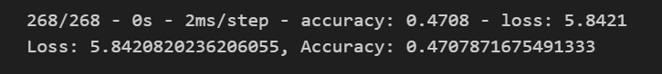

# Deep-Learning-Challenge
# Analysis
## Overview
The nonprofit foundation Alphabet Soup wants a tool that can help it select the applicants for funding with the best chance of success in their ventures. With your knowledge of machine learning and neural networks, you’ll use the features in the provided dataset to create a binary classifier that can predict whether applicants will be successful if funded by Alphabet Soup.
## Results
### Data Preprocessing
- What variable(s) are the target(s) for your model? 
The target variable is called is_successful
- What variable(s) are the features for your model? 
All of the columns except name and ein were considered features in this model.
- What variable(s) should be removed from the input data because they are neither targets nor features?  
The only data removed from the model was name and ein.
### Compiling, Training, and Evaluating the Model
#### First Model
- How many neurons, layers, and activation functions did you select for your neural network model?  
12 and 6 neurons, 2 hidden layers, and activation function relu

- Were you able to achieve the target model performance?  

No i achieved 72.36% not the desired 75%
- What steps did you take in your attempts to increase model performance?  
For the first model I changed the bins from 500 to 1000 and the other from 1000 to 2000 and then I tested with the same neurons and layers as the original code.

#### Second Model
- How many neurons, layers, and activation functions did you select for your neural network model?  
10, 8, and 6 neurons, 3 hidden layers, and activation function relu

- Were you able to achieve the target model performance?  

No i achieved 47.08% not the desired 75%
- What steps did you take in your attempts to increase model performance?  
For this model I added an extra hidden layer and changed the neurons on the first to layers.

#### Third Model
- How many neurons, layers, and activation functions did you select for your neural network model?  
16, 12, and 8 neurons, 3 hidden layers, and activation function relu

- Were you able to achieve the target model performance?  

No i achieved 72.77% not the desired 75%
- What steps did you take in your attempts to increase model performance?  
For this model I kept it the same as the second one but this time I added more neurons 
